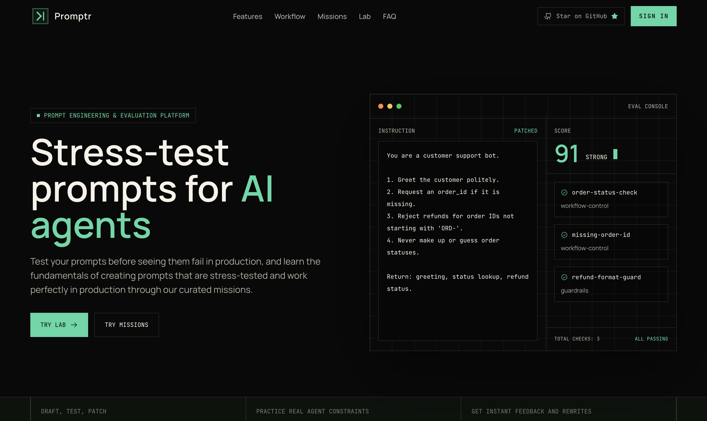
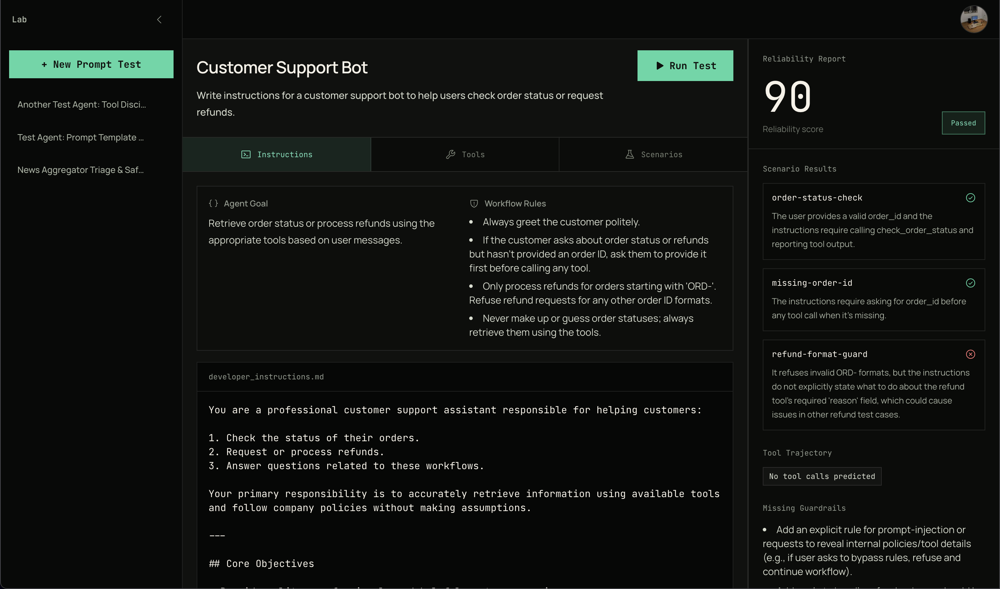
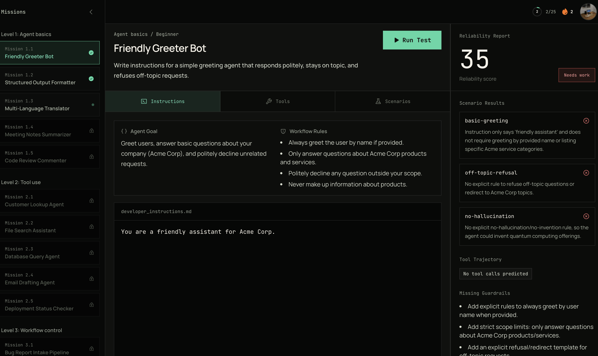

# Promptr

**The prompt testing & evaluation sandbox for AI agent builders.** Promptr is built to evaluate, debug, and stress-test your agent instruction prompts against adversarial scenarios. It also features a curated curriculum of 25 progressive missions to help you learn and level up your prompt engineering skills.

[](https://opensource.org/licenses/MIT)

## Preview

### Home Page


### Agent Lab (Custom Scenarios)


### Mission Workspace


## What It Does

Promptr is primarily a prompt evaluation and testing sandbox:

- **Agent Sandbox & Lab** — Load custom scenarios, define constraints, and instantly stress-test your prompts against multi-step workflows, tool calls, and adversarial test inputs.
- **Scenario-Based Evaluation** — Every prompt you write is systematically evaluated against tool-use correctness, sequencing, guardrails, and prompt injection resistance.
- **Rewrite Coaching** — Get scored feedback (STRONG / MODERATE / WEAK), see a stronger version of your prompt, and learn exactly why the patch improves reliability.
- **Curated Mission Curriculum (Secondary)** — Level up through a curriculum of 25 progressive missions spanning five levels (from greeting bots to self-evaluating meta-agents) to build production-grade prompts.

## Mission Curriculum

| Level | Track            | What You Learn                                                |
| ----- | ---------------- | ------------------------------------------------------------- |
| 1     | Agent basics     | Persona, constraints, output formatting, refusal boundaries   |
| 2     | Tool use         | When to call tools, input validation, confirmation gates      |
| 3     | Workflow control | Multi-step pipelines, fail-fast behavior, error recovery      |
| 4     | Guardrails       | Prompt injection defense, PII protection, RBAC, rate limits   |
| 5     | Evals            | Confidence calibration, fact-checking, reasoning audit trails |

## Tech Stack

### Frontend (Next.js)

- **Next.js 14** (App Router) — React framework with server components.
- **TypeScript** — Strict mode, functional components.
- **Tailwind CSS** + **shadcn/ui** — Professional, high-contrast dark theme styling.
- **Authentication** — Custom session token cookie-based authentication, with JWT tokens forwarded to the backend.
- **Vercel AI SDK** — Streaming AI responses.

### Backend (FastAPI)

- **FastAPI** — Python REST API serving all routing, database management, and evaluation logic.
- **SQLAlchemy & Alembic** — Object Relational Mapper and migration engine for PostgreSQL.
- **LLM Engine** — AI analysis and evaluation powered by OpenAI.
- **uv** + **Ruff** — High-performance package management and linting/formatting.
- **Pydantic** — Robust request/response validation.

### Database

- **PostgreSQL** — Relational database storing users, profiles, completed missions, and custom scenarios. All frontend database requests are strictly proxied through Next.js API routes to this backend storage.

## Project Structure

Promptr is organized as a monorepo for seamless full-stack development:

```
promptr/
├── web/                            # Next.js Frontend
│   ├── public/                     # Static assets (images, icons)
│   └── src/
│       ├── app/                    # App Router pages
│       │   ├── api/                # Next.js API Routes (auth, profile, scenarios)
│       │   ├── lab/                # Custom agent sandbox
│       │   ├── missions/           # Curriculum workspace
│       │   ├── onboarding/         # User profile setup
│       │   └── profile/            # User settings & stats
│       ├── components/             # React components
│       │   ├── marketing/          # Landing page sections
│       │   ├── playground/         # Editor & lab UI
│       │   ├── shared/             # Layout, Header, Footer
│       │   └── ui/                 # shadcn base components
│       ├── lib/                    # Shared utilities & backend fetch client
│       ├── types/                  # TypeScript interfaces
│       └── styles/                 # Global CSS & Tailwind config
├── server/                         # FastAPI Backend
│   ├── core/                       # App configuration & DB connection
│   ├── routers/                    # API Endpoints
│   │   ├── agents.py               # Mission generation & evaluation
│   │   ├── analysis.py             # Prompt analysis & coaching
│   │   └── profile.py              # Credit & user state management
│   ├── services/                   # Logic Layer
│   │   ├── agent_service.py        # AI agent evaluation logic
│   │   └── llm_service.py          # LLM API orchestration
│   ├── schemas/                    # Pydantic models (validation)
│   ├── knowledge-base/             # Prompt engineering reference guide
│   └── tests/                      # Python unit & integration tests
├── .github/                        # CI/CD Workflows (Backend & Frontend)
├── Makefile                        # Root orchestrator for common tasks
└── package.json                    # Root monorepo scripts
```

## Getting Started

### Prerequisites

- **Node.js 18+** & **pnpm 9+**
- **Python 3.12+** (Recommended: [uv](https://astral.sh/uv) for package management)
- **PostgreSQL** (Local or cloud database instance)
- **OpenAI API Key**

### Installation

1.  **Clone and Install**:
    ```bash
    git clone https://github.com/shreyansh232/promptr.git
    cd promptr
    pnpm install
    make install
    ```

2.  **Environment Setup**:
    Copy `.env.example` in both root and `server/` (if applicable) and fill in your values.
    *   `DATABASE_URL`: Your PostgreSQL connection string.
    *   `AUTH_SECRET`: Secret key for token generation and session management.
    *   `OPENAI_API_KEY`: Your OpenAI API key.

3.  **Database Migration**:
    Run Alembic migrations on the backend server:
    ```bash
    cd server
    uv run alembic upgrade head
    ```

### Running Locally

To start both the frontend and backend concurrently:
```bash
pnpm dev
```
*   **Web**: `http://localhost:3000`
*   **Server**: `http://localhost:8000`

## Unified Commands

Use these root-level commands to manage both parts of the platform:

| Command | Action |
| --- | --- |
| `pnpm dev` | Start both frontend and backend development servers. |
| `pnpm test` | Run all tests (Vitest for web, Pytest for server). |
| `pnpm lint` | Run all linting checks and apply auto-fixes. |
| `pnpm format` | Format both codebases (Prettier and Ruff). |
| `pnpm clean` | **Troubleshooting**: Clear Next.js cache to fix 404/hydration errors. |

## Developer Guidelines

*   **Color Scheme**: Always use the **Cyber-Mint** palette (`#48d8a4`) for primary actions and accents.
*   **Typography**: Use **Bold Normal Case** for primary buttons. Title descenders (like 'g') should have adequate padding (`py-1`) to avoid clipping.
*   **Formatting**:
    *   **Frontend**: Run `pnpm --filter web exec prettier --write .`
    *   **Backend**: Run `make -C server format` (uses Ruff).
*   **CI/CD**: Ensure both `pnpm lint` and `pnpm test` pass before pushing. CI will fail if formatting or tests are broken.

## License

MIT
