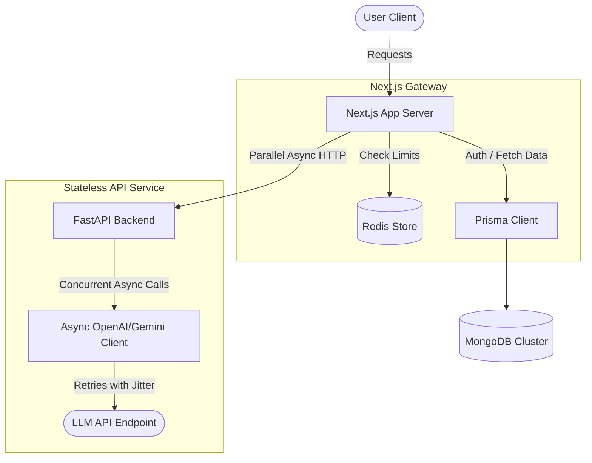

# Promptr System Design & Scaling Enhancement Plan

This document outlines key architectural bottlenecks identified in the Promptr codebase (Next.js + FastAPI + MongoDB/Prisma) and details proposed design enhancements to achieve production-grade performance, high concurrency, and horizontal scalability.

---

## 1. High-Impact Performance Bottlenecks

### 1.1 FastAPI Event Loop Blocking (Critical)
* **Root Cause**: All API endpoints (e.g., `/analyze-prompt`, `/evaluate-prompt`, `/agent-missions/generate`) are declared as `async def` in the routing layer, but they call synchronous blocking LLM service functions (e.g., `_send_prompt` utilizing a blocking `OpenAI()` client).
* **Impact**: In FastAPI, calling blocking functions inside `async def` route handlers executes them on the main thread, blocking the event loop. The entire worker becomes unresponsive to other concurrent requests during the 1-3 second LLM latency.
* **Resolution**: 
  1. Transition from the synchronous `OpenAI()` client to `AsyncOpenAI()` in `backend/services/llm_service.py`.
  2. Rewrite all service-level LLM calls to use `await client.chat.completions.create(...)`.

### 1.2 Sequential LLM Evaluation Triggers (Critical)
* **Root Cause**: When a user submits a prompt, it is evaluated against multiple test cases. In `evaluate_prompt_full`, evaluation is run sequentially in a blocking `for` loop.
* **Impact**: If a mission/problem contains 5 test cases and each LLM API call takes 2 seconds, the client faces a 10-second blocking wait time, leading to poor UX and high connection pool usage.
* **Resolution**: Use `asyncio.gather` to concurrently execute evaluation calls for all test cases, reducing the total latency to the duration of the slowest single evaluation (~2 seconds).

```python
# Before (Sequential Blocking)
results = []
for tc in test_cases:
    result = evaluate_prompt_against_test_case(...)
    results.append(result)

# After (Concurrent Async)
tasks = [
    evaluate_prompt_against_test_case_async(user_prompt, tc, ...) 
    for tc in test_cases
]
results = await asyncio.gather(*tasks)
```

---

## 2. Scalability & Concurrency Bottlenecks

### 2.1 In-Memory Rate Limiting (High)
* **Root Cause**: The Next.js API layer implements rate limiting using an in-memory `Map` (`const store = new Map()` in `src/lib/rate-limit.ts`).
* **Impact**: If the application scales horizontally to multiple server instances or runs in serverless functions (e.g., Vercel), the rate-limiting state is split, allowing users to bypass limits. It also resets on cold starts.
* **Resolution**: 
  * Integrate Redis (or MongoDB via a collection with a TTL index) for distributed rate-limiting state management using a sliding-window token bucket algorithm.

### 2.2 Credit Deduction Race Conditions (High)
* **Root Cause**: The FastAPI `/profiles/{user_id}/deduct` endpoint performs a stale read (`await get_profile`), evaluates if the user has sufficient credits, and then increments negatively:
  ```python
  if profile["credits"] < amount:
      return {"allowed": False, "remaining": profile["credits"]}
  await db.profiles.update_one({"userId": user_id}, {"$inc": {"credits": -amount}})
  ```
* **Impact**: Under high concurrency (e.g. concurrent prompt submissions), users can bypass the credit check, allowing their balance to drop below zero.
* **Resolution**: Perform check-and-deduction in a single atomic database query:
  ```python
  res = await db.profiles.update_one(
      {"userId": user_id, "credits": {"$gte": amount}},
      {"$inc": {"credits": -amount}}
  )
  if res.modified_count == 0:
      return {"allowed": False, "remaining": ...}
  ```

---

## 3. Database Architecture & Sync Overhaul

### 3.1 Split-Brain Database Access
* **Root Cause**: Next.js uses Prisma ORM to talk to MongoDB, while the Python FastAPI backend uses its own async client (`motor.motor_asyncio`) to query the same database collections.
* **Impact**: Changes to schemas (e.g., `schema.prisma`) are not enforced on the Python side. Data structures must be maintained in two places, increasing query drift risks.
* **Resolution**:
  * **Option A (Stateless Backend - Recommended)**: Move all database queries out of Python. The FastAPI backend becomes a stateless prompt execution/evaluation service. Next.js fetches user profiles and saves progress, passing all context to FastAPI in the request body.
  * **Option B (Shared Schema Guard)**: Implement Pydantic-based strict validations matching Prisma's schema and run schema sync tests inside CI/CD pipelines.

---

## 4. Production Observability & Error Resiliency

### 4.1 Lack of Structured Logging
* **Bottleneck**: The system uses generic print statements in python and standard `console.log` in TypeScript.
* **Resolution**:
  1. Add a structured logger (e.g., `pino` in Next.js, `structlog` in Python) outputting JSON.
  2. Implement Correlation IDs (`X-Correlation-ID`) across HTTP boundaries to trace a user request from Next.js to FastAPI and down to the LLM.

### 4.2 LLM Call Resiliency
* **Bottleneck**: Network requests to the LLM API are susceptible to transient network failures, rate limit blocks, and context timeouts.
* **Resolution**:
  * Implement retry policies with exponential backoff and jitter (using libraries like `tenacity` in Python) specifically around LLM call wrappers.

---

## 5. Summary of Recommended Enhancements


